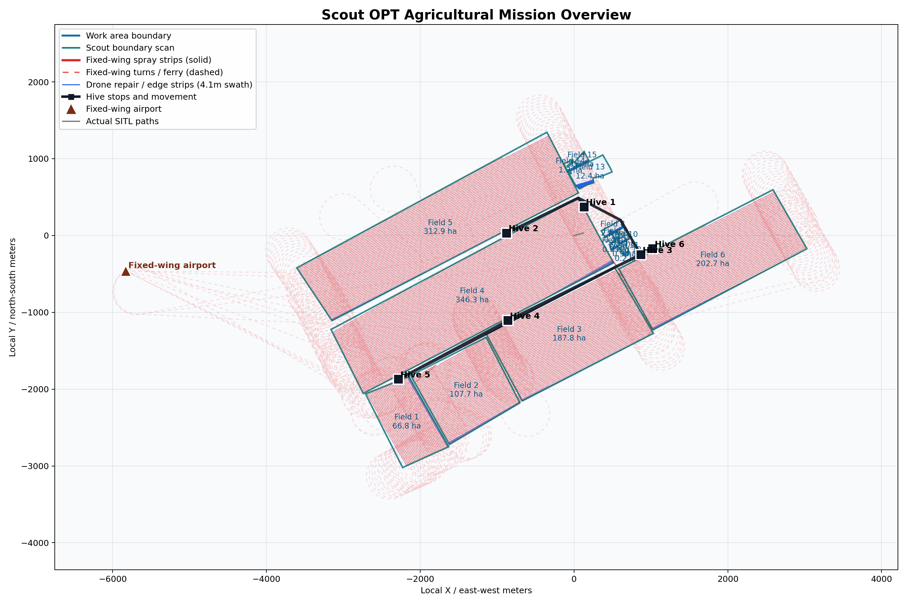

# Fixed-Wing Aircraft + Hive-Based Multi-UAV Agricultural OPT Simulation System

> This project is under active development. The current version is a C-based virtual testbed for mission planning, resource scheduling, Hive relocation, drone repair work, and hybrid fixed-wing aircraft + multi-UAV agricultural operations.

## Latest Xiaolizhuang OPT Preview

The first image is the generated mission overview. The second image overlays the same OPT result on satellite imagery.




> Note: the small fragmented plots in the upper-right corner are intentional boundary-case test areas. They are used to test edge-field handling, small polygon decomposition, UAV repair routing, and whether the planner can avoid treating every field as a clean rectangular strip.

## Overview

This project simulates a scout-driven agricultural operation system that combines:

- A mobile Hive / mothership for drone launch, recovery, charging, refilling, RTK/communication support, and field-side scheduling.
- A fleet of up to 8 agricultural UAVs for scouting, boundary work, precision spraying, repair strips, cleanup, and assistance.
- Optional fixed-wing agricultural aircraft, such as an Air Tractor AT-502B style model, for large efficient strip spraying.
- QGroundControl polygon input for manually selected work areas.
- ArduPilot SITL / QGroundControl visualization support for virtual mission replay.

The goal is not only to plan flight paths, but to optimize the complete agricultural work cycle:

```text
Manual field selection
  -> Scout boundary confirmation
  -> Polygon field modeling
  -> Small work-zone generation
  -> Fixed-wing / drone task split
  -> Hive stop optimization
  -> Weather-aware scheduling
  -> Charging / refilling / recovery
  -> Rolling Hive relocation and cleanup
```

## What This Project Does

The simulator evaluates how to complete large agricultural work areas efficiently under resource constraints:

- Drone battery and chemical tank capacity.
- Fixed-wing spray tank and fuel endurance.
- Hive movement speed, stop count, and deployment constraints.
- Charging/refilling queues.
- Weather effects on spray quality, flight speed, and emergency recovery.
- Field geometry, including multi-polygon work areas.
- Hive route constraints: Hive stops and Hive movement routes must stay outside work polygons.

The current demonstration uses:

- 8 UAVs.
- 2 fixed-wing agricultural aircraft when the OPT model selects parallel fixed-wing capacity for large fields.
- 1 mobile Hive.
- 15 QGroundControl field polygons from the Xiaolizhuang plan, including several small boundary-test plots.
- A hybrid spraying plan where fixed-wing aircraft handles suitable long interior strips and drones handle boundary, repair, and precision work.

## Current Simulation Result

For the included example mission:

```text
Total work area:        1245.81 ha
Completed area:         1245.81 / 1245.81 ha
Total simulated time:   5.32 h
Hive stops:             6
Fixed-wing model:       Air Tractor AT-502B style model
Fixed-wing work:        1222.45 ha
Drone / repair work:    about 23.36 ha
```

Spray width / radius currently used by the model:

```text
DJI T200-style UAV:
  Spray speed:          5.4 m/s
  Spray productivity:   6.221 ha/h
  Spray width:          3.2 m
  Spray radius:         1.6 m

Air Tractor AT-502B-style fixed-wing:
  Work speed:           59.0 m/s
  Spray width:          19.8 m
  Spray radius:         9.9 m
```

## Algorithms and Optimization Methods

The project currently uses a layered heuristic OPT pipeline rather than a single black-box solver.

Implemented methods include:

- **Greedy coverage selection** for choosing Hive operation stops based on task coverage benefit.
- **Movement-cost-aware scoring** for Hive stop selection, including stop count cost and Hive travel time.
- **Polygon-constrained Hive routing**, where Hive routes cannot pass through work areas and must detour along exterior field boundaries when needed.
- **Nearest and capacity-aware multi-agent task allocation** for assigning drone work.
- **Dynamic remaining-capacity modeling** using battery, chemical, return energy, and safety margin.
- **Mothership-centered working radius scheduling** for assigning near/mid/far tasks around the active Hive stop.
- **Rolling relocation logic**, where Hive movement is delayed until cleanup/predeployment windows so drones are not stranded.
- **Assistance and cleanup heuristics**, where drones with remaining capacity can help unfinished tasks.
- **Hybrid fixed-wing task split**, where suitable large interior strips are assigned to fixed-wing aircraft and drones handle unsuitable strips, boundary work, and repair areas.
- **Aircraft selection scoring**, including swath width, work speed, spray tank area, fuel endurance, setup time, turnaround time, route/ferry cost, and economic penalty.
- **Weather-aware adjustment**, affecting spray effectiveness, flight speed, battery drain, and emergency recovery behavior.
- **2-opt style Hive stop ordering refinement** for reducing unnecessary movement.

The model is designed for front-end mission reasoning and simulation. It is not yet a certified real-world autonomous flight controller.

## Repository Structure

```text
c_include/                  Public C headers and data models
c_src/                      Core C simulation, OPT engine, config loader, diagnostics
configs/                    Scenario JSON files and exported OPT visual plan
scripts/                    QGC conversion, ArduPilot bridge, visualization helpers
planexample/                Example QGroundControl plan files
docs/                       README images and documentation assets
legacy_python/              Archived early Python prototype
build.ps1                   Windows build helper
Makefile                    GCC/Clang build entry
CMakeLists.txt              CMake build entry
```

## Build

On Windows PowerShell:

```powershell
.\build.ps1
```

Run after building:

```powershell
.\scout_opt.exe --scenario configs\Xiaolizhuang_from_qgc_fence.json --fixed-wing --steps 12000 --diagnostics
```

With CMake:

```powershell
cmake -S . -B build
cmake --build build
.\build\scout_opt.exe
```

With Make:

```powershell
make
.\scout_opt.exe
```

## Basic Usage

Run the included QGroundControl polygon scenario:

```powershell
.\scout_opt.exe --scenario configs\Xiaolizhuang_from_qgc_fence.json --fixed-wing --steps 12000 --diagnostics
```

Export a visual plan:

```powershell
.\scout_opt.exe --scenario configs\Xiaolizhuang_from_qgc_fence.json --fixed-wing --steps 12000 --export-visual configs\xiaolizhuang_opt_visual_plan.json --diagnostics
```

Render the mission overview image:

```powershell
python scripts\render_opt_overview.py --plan configs\xiaolizhuang_opt_visual_plan.json --out docs\xiaolizhuang_mission_overview.png
python scripts\render_satellite_png.py --plan configs\xiaolizhuang_opt_visual_plan.json --out docs\xiaolizhuang_satellite_overlay.png --zoom 14
```

Convert a QGroundControl `.plan` file into a scenario:

```powershell
python scripts\qgc_plan_to_scenario.py planexample\Xiaolizhuang.plan -o configs\Xiaolizhuang_from_qgc_fence.json
```

Compare layout assumptions:

```powershell
.\scout_opt.exe --compare-layouts 12 --steps 5000
```

Run the acceptance suite:

```powershell
.\scout_opt.exe --acceptance
```

## QGroundControl / ArduPilot SITL Replay

Generate the scenario and OPT visual plan:

```powershell
python scripts\qgc_plan_to_scenario.py planexample\Xiaolizhuang.plan -o configs\Xiaolizhuang_from_qgc_fence.json
.\scout_opt.exe --scenario configs\Xiaolizhuang_from_qgc_fence.json --fixed-wing --steps 12000 --export-visual configs\xiaolizhuang_opt_visual_plan.json
```

Start the real ArduPilot SITL OPT bridge:

```powershell
powershell -ExecutionPolicy Bypass -File .\scripts\start_real_opt_ardupilot.ps1 -Count 8 -PlaneCount 1 -RoverCount 1
```

In QGroundControl:

```text
SYSID 1..8    UAV fleet
SYSID 100     Fixed-wing agricultural aircraft
SYSID 200     Hive / mobile mothership
```

The bridge expands Hive movement routes so the Hive/Rover does not drive through work polygons.

## Important Notes

- This is a simulation and research prototype.
- Real-world use would require validated flight control integration, regulatory compliance, safety review, obstacle sensing, geofence enforcement, and hardware-specific testing.
- The fixed-wing model currently represents an agricultural aircraft class inspired by AT-502B-style parameters.
- The UAV model currently uses a DJI T200-style heavy agricultural drone abstraction.
- The project is still actively updated, especially around polygon decomposition, route-cost optimization, and more realistic ArduPilot replay behavior.

## Development Roadmap

- Improve polygon decomposition for more accurate small work-zone generation.
- Add stricter fixed-wing turn radius and runway/airport constraints.
- Add better road-network modeling for Hive route planning.
- Add per-drone heterogeneous payload and battery profiles.
- Add richer weather and spray drift modeling.
- Expand ArduPilot SITL replay from route following toward mission-level autonomous execution.

## License

No license has been selected yet. Treat the project as private research code until a license is added.
