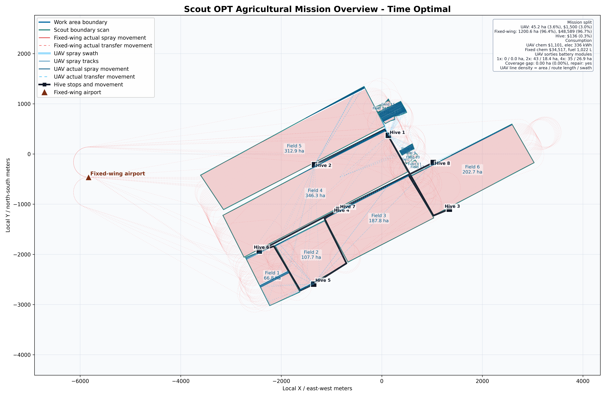
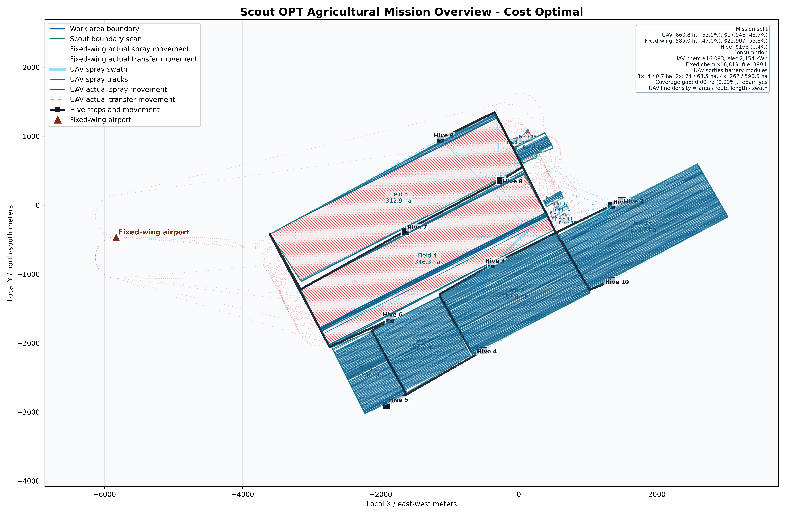
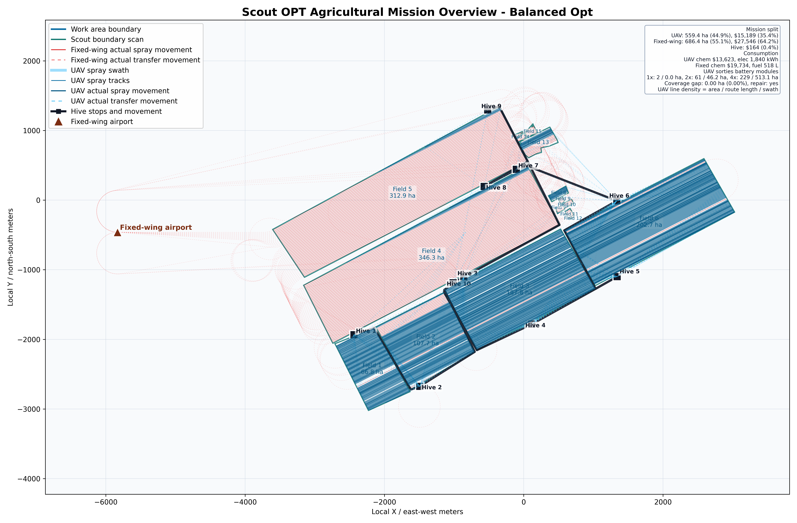

# Fixed-Wing + Hive-Based Multi-UAV Agricultural OPT Simulation

This project is a C-based virtual testbed for agricultural mission planning. It models a mobile Hive, a multi-UAV spraying fleet, optional fixed-wing agricultural aircraft, polygon field decomposition, charging/refilling queues, route optimization, and visual mission export.

The model is a research and simulation prototype. It is not a certified flight controller or a validated manufacturer digital twin.

## Table of Contents

- [Latest Xiaolizhuang Profile Outputs](#latest-xiaolizhuang-profile-outputs)
- [Current System](#current-system)
- [Code and Data Flow](#code-and-data-flow)
- [Main Implemented Features](#main-implemented-features)
- [Path Allocation and Platform Split](#path-allocation-and-platform-split)
- [Cost Model](#cost-model)
- [Coverage Tolerance and Final Repair](#coverage-tolerance-and-final-repair)
- [Algorithms](#algorithms)
- [Repository Structure](#repository-structure)
- [Source Code Guide](#source-code-guide)
- [Build](#build)
- [Normal Xiaolizhuang Workflow](#normal-xiaolizhuang-workflow)
- [QGroundControl / ArduPilot SITL Replay](#qgroundcontrol--ardupilot-sitl-replay)
- [Important Notes](#important-notes)

## Latest Xiaolizhuang Profile Outputs

The three images below are generated from the same Xiaolizhuang QGroundControl field plan using the three optimization profiles. Each image is rendered from the exported JSON plan, so the visible routes, swaths, costs, coverage gap summary, and platform split come from the simulator output rather than a hand-drawn sketch.

Latest validation run:

| Profile | Mission total (USD) | Selected trial | Trial selection score | Mission time (h) | Coverage check |
|---|---:|---:|---:|---:|---|
| `time` | 50,022.36 | 2 / 20 | 49,421.89 | 10.90 | OK, final uncovered 0.76% |
| `cost` | 41,021.28 | 18 / 20 | 87,028.48 | 12.95 | OK, final uncovered 0.91% |
| `balanced` | 42,898.16 | 6 / 20 | 68,577.25 | 11.55 | OK, final uncovered 1.34% |

`Mission total` is the final reported cost from `cost_summary.mission_total_usd`. `Trial selection score` comes from `planner_search.selection_cost_usd`; it is an internal deterministic score used only to pick the best trial inside one profile. It includes direct cost plus unfinished/open-task penalties, so it is not the final mission bill and should not be compared across `time`, `cost`, and `balanced`.

### Time Opt



### Cost Opt



### Balanced Opt



## Current System

The simulator combines:

- A mobile Hive / mothership for launch, recovery, charging, refilling, RTK/communication support, and relocation.
- Up to 8 DJI T200-style agricultural UAV abstractions.
- Optional fixed-wing agricultural aircraft using an AT-502B-style agricultural aircraft model.
- QGroundControl polygon input for selected work areas.
- Three optimization profiles: `time`, `cost`, and `balanced`.
- Built-in demo layouts for normal, ideal, irregular, and hybrid field patterns.
- Visual-plan JSON export and local overview rendering.
- Optional ArduPilot SITL / QGroundControl replay support.

The normal mission pipeline is:

```text
QGroundControl field polygons
  -> scenario JSON
  -> scout / field modeling
  -> polygon decomposition
  -> UAV / fixed-wing task split
  -> Hive stop planning
  -> charging, refilling, recovery, and relocation simulation
  -> visual-plan JSON
  -> overview image / optional replay
```

## Code and Data Flow

The project is organized around one main C simulation loop and several export / rendering tools:

```text
planexample/Xiaolizhuang.plan
  -> scripts/qgc_plan_to_scenario.py
  -> configs/Xiaolizhuang_from_qgc_fence.json
  -> c_src/main.c
  -> c_src/config_loader.c
  -> c_src/scout_opt.c
  -> c_src/diagnostics.c
  -> c_src/visual_export.c
  -> configs/xiaolizhuang_*_visual_plan.json
  -> scripts/check_coverage_gaps.py
  -> scripts/render_opt_overview.py
  -> docs/*.png / docs/*coverage_gaps.json
```

The central runtime object is `SoSimulation` in `c_include/scout_opt.h`. It owns the field polygons, generated tasks, UAV fleet, fixed-wing fleet, Hive state, service queues, weather state, accumulated costs, coverage policy, and exported route logs.

The main runtime path is:

1. `main.c` parses CLI arguments and chooses scenario / profile / export options.
2. `config_loader.c` loads field polygons and scenario parameters from JSON.
3. `scout_opt.c` builds tasks, chooses fixed-wing/UAV allocation, plans Hive stops, runs UAV/fixed-wing scheduling, applies battery/refill/fuel/chemical limits, and records actual routes.
4. `diagnostics.c` validates state consistency, coverage limits, field-level remaining work, and resource sanity.
5. `visual_export.c` writes the visual-plan JSON used by the Python renderers and coverage checker.
6. `render_opt_overview.py` renders the readable overview image.
7. `check_coverage_gaps.py` samples each field polygon against exported spray swaths to estimate field-level and total uncovered area.

The C CLI also exposes quick synthetic layout modes for regression and comparison work:

| Option | Purpose |
|---|---|
| `--two-blocks` | Small two-field demo. |
| `--blocks N` | Generated multi-block UAV-only layout. |
| `--ideal-blocks N` | Regular strip-like layout for clean route behavior checks. |
| `--irregular-blocks N` | Irregular/scarce-depot layout for stress testing. |
| `--hybrid-blocks N` | Generated hybrid fixed-wing/UAV layout. |
| `--compare-layouts N` | Runs normal, ideal, irregular, and hybrid cases and reports the best productivity. |
| `--sitl-plan` | Prints an ArduPilot SITL link plan from the current C simulation state. |

## Main Implemented Features

### Field and Task Modeling

- Converts QGroundControl polygon/fence plans into simulator scenarios.
- Supports multiple selected field polygons, including fragmented and small plots.
- Decomposes fields into interior strips, boundary tasks, repair tasks, and residual UAV work.
- Tracks per-task area, route endpoints, optional route midpoint, platform assignment, turn burden, and remaining work.
- Keeps Hive stops and Hive driving paths outside work polygons when possible.
- Allows bounded agricultural edge tolerance: operational routing may stop with up to 2% uncovered area, final accepted uncovered area must remain below 3%, and the simulator estimates a UAV cleanup repair. If that repair costs no more than 5% of the current direct mission cost, the repair is automatically selected.

Scenario JSON loading supports:

- `origin` latitude/longitude for local-meter to map conversion.
- `field_blocks` with `id`, `selected`, `risk`, `area_hectares`, optional `center`, and polygon `boundary_points`.
- Automatic area and centroid calculation from polygon boundaries when available.
- `depot_sites` with `point`, `usable_area_m2`, `road_accessible`, and `slope_risk`.
- Fallback depot generation near field blocks if no depot list is provided.
- `terrain_complexity` and `obstacle_density`, which affect route risk and fixed-wing/UAV suitability.

### UAV Model

The UAV is modeled as a DJI T200-style agricultural platform abstraction:

```text
UAV count:                    8
Modeled payload capacity:     200 kg
Spray swath:                  10.0 m
Spray productivity:           30.0 ha/h per UAV
Effective chemical need:      18.0 L/ha
Deposition efficiency:        0.85
Applied spray volume:         21.176 L/ha
Chemical cost:                1.15 USD/L
Flight cost:                  0.45 USD/km
Launch cost:                  2.70 USD/takeoff
Electricity price:            0.12 USD/kWh
Battery depreciation:         excluded
```

The UAV battery model supports 1-4 DB2400 battery modules:

```text
Battery module capacity:      2.402 kWh
Battery module weight:        16.0 kg
Fast chargers:                4
Battery slots per charger:    2
Total battery charge slots:   8
Single-battery rotation mode: 7-8 min from 0-100%
Two-battery parallel mode:    12-13 min from 0-100%
Refill ports:                 2
```

The simulation can select a battery configuration per UAV sortie. Allowed work-sortie configurations are 1, 2, or 4 DB2400 modules. Battery count affects energy capacity, charging time, work-power demand, empty-flight energy, and modeled chemical capacity. In the current payload assumption, the first battery is treated as the base aircraft configuration, while extra batteries consume available 200 kg payload capacity:

```text
Chemical tank L =
    200 kg payload capacity
  - 15 kg spray system
  - extra_battery_count * 16 kg
```

So the current nominal tank capacities are:

| Battery modules | Tank capacity |
|---:|---:|
| 1 | 185 L |
| 2 | 169 L |
| 3 | 153 L |
| 4 | 137 L |

Each time a UAV launches from the Hive, the planner compares the allowed battery configurations against task area, outbound distance, return-energy reserve, chemical capacity, and payload weight. The selected sortie configuration is then held for any in-air continuation work until that UAV returns to the Hive. Visual-plan export reports the sortie count and completed area by battery configuration in `drones.sortie_battery_options`.

The Hive also models launch, recovery, and battery-handling service constraints:

```text
Takeoff service time:         random 5-8 s
Landing service time:         random 5-8 s
Launch/landing concurrency:   2 UAVs
Charger insert service time:  random 5-8 s
Charger remove service time:  random 5-8 s
Charger handling concurrency: 2 batteries
```

Each operation draws its own value from a uniform 5-8 s range. A UAV must consume launch/landing service capacity before a new sortie starts and again when it lands at the Hive. A battery that enters a charger consumes charger-handling capacity, and a charged battery must consume charger-handling capacity again before the UAV can leave the charging state. The visual-plan JSON exports these limits as `drones.launch_landing_slots`, `drones.charger_handling_slots`, `drones.service_time_model`, `drones.service_time_min_s`, and `drones.service_time_max_s`.

### Fixed-Wing Model

The fixed-wing planner selects from fixed-wing aircraft abstractions. The current Xiaolizhuang runs generally select the AT-502B-style option, while the fleet selector also contains a larger fixed-wing candidate for scenarios where larger swath/payload assumptions win the planning score.

AT-502B-style reference values:

```text
Tank:                         1893 L
Payload:                      2450 kg
Fuel:                         644 L
Work speed:                   59.0 m/s
Swath:                        19.8 m
Modeled productivity:         about 280 ha/h per aircraft
Turn radius:                  300 m
Flight cost:                  6.50 USD/km
Takeoff cost:                 120 USD/sortie
Airport service cost:         180 USD/sortie
Fuel burn:                    205 L/h
Fuel price:                   1.03 USD/L
Effective chemical need:      18.0 L/ha
Deposition efficiency:        0.72
Applied spray volume:         25.0 L/ha
Chemical cost:                1.15 USD/L
```

Fixed-wing aircraft cannot spray during turn segments. The model accounts for airport/service cost, fuel, ferry/empty flight, minimum turn radius, tank area, and field fragmentation.

The fixed-wing fleet selector estimates eligible fixed-wing area, average ferry burden, tank area, fuel endurance, turnaround time, and aircraft count. It then chooses the fleet setup before the fixed-wing task filter and route strategy comparison run.

### Chemical Cost Accounting

Chemical cost is included in total cost for both platforms:

```text
UAV chemical cost =
    UAV treated area
  * UAV applied L/ha
  * chemical USD/L

Fixed-wing chemical cost =
    fixed-wing treated area
  * fixed-wing applied L/ha
  * chemical USD/L
```

The exported visual-plan JSON includes:

```text
chemical_application_model
cost_summary.uav_chemical_usd
cost_summary.fixed_wing_chemical_usd
drones.chemical_cost_usd
fixed_wing.chemical_cost_usd
```

### Hybrid UAV / Fixed-Wing Allocation

The planner does not force all large fields onto fixed-wing aircraft. It compares UAV and fixed-wing task economics using:

- Chemical cost.
- UAV electricity and launch cost.
- UAV empty flight and return energy.
- UAV tank, battery, charging, refill, and effective fleet-rate limits.
- Fixed-wing fuel, airport, takeoff, ferry, turn, and spray cost.
- Field size, field shape, fragmentation, risk, and route continuity.
- Unfinished-area penalties.

The fixed-wing planner evaluates:

```text
multi_island
partition_dp
longest_corridor
```

Each candidate is scored with UAV fallback cost. The chosen plan is then committed to tasks and exported as `fixed_wing_path_strategy`.

After fixed-wing assignment is committed, the remaining unassigned area is rebuilt as a spatial UAV residual work set. For every selected polygon block, the simulator scans the field polygon with UAV swath marks and subtracts fixed-wing swath rectangles from those scanlines. The remaining clipped line segments become UAV residual places with new centers and route endpoints. These spatial residual tasks are then rescored using nearby deployable depot coverage, Hive route distance, and route-limited access risk. Hive stop planning runs on this rebuilt spatial work set, so the Hive does not plan from the original pre-split task list.

For small candidate sets, the planner uses bitmask DP. For larger sets, it uses greedy marginal route-cost heuristics.

### Optimization Profiles

The CLI exposes three profiles:

| Profile | Intent |
|---|---|
| `time` | Accepts more fixed-wing cost when it materially reduces completion time. |
| `cost` | Favors lower direct operating cost and only accepts fixed-wing when cheaper or within bounded time-rescue rules. |
| `balanced` | Mixes cost, time, empty flight, and turn burden. |

The route-selection and platform-allocation code uses profile-specific guards so a single platform does not dominate purely because of one unrealistic advantage.

### UAV Effective Fleet Rate

The planner no longer treats UAV capacity as a simple ideal rate such as:

```text
drone_count * spray_rate * constant
```

Instead, it estimates an effective parallel UAV rate using:

- Drone count.
- Selected battery modules.
- Chemical tank area per sortie.
- Work energy.
- Fast charger count, two-battery charger slots, and charge mode speed.
- Refill-port count.
- Charging and refilling service pressure.

This prevents the planning stage from overrating the UAV fleet when many short sorties, charging, and refilling cycles are required.

### Route Direction and Internal Track Changes

Both UAV and fixed-wing routes can choose the better direction for a task:

```text
current position -> better route entry -> spray route -> route exit
```

UAV and fixed-wing aircraft use different internal turn models.

UAV internal track changes are modeled as multi-rotor movements:

```text
spray one track
  -> decelerate at the end while keeping spray enabled
  -> move laterally or diagonally to the next track while spraying
  -> spray the next track in the opposite direction
```

This applies inside a small work area. On a square end, the shift is mostly lateral. On an oblique field boundary, the shift may be diagonal along the edge. The UAV does not need to leave the field before moving to the next track. These connecting movements are sprayable coverage segments, consume chemical, and are counted in `turn_count`, `turn_time_s`, and `turn_energy_cost`, but they are not fixed-wing radius turns and do not use `route_curve_deg`.

When multiple UAVs assist the same task, the later UAVs do not shift the whole route sideways. The scheduler records how much area is already completed or actively committed by other UAVs, then starts the assisting UAV on the next uncommitted pass band. For planned strip tasks, an assisting UAV also prefers the opposite route end when that is closer to the already active route, so assistance does not simply repeat the first UAV's entry.

For regular interior strip tasks, UAV passes are snapped to a block-level swath mark grid. The planner projects the polygon onto the cross-track axis, places marks every UAV swath width, and then clips each pass to the task's original along-track interval. This keeps rectangular fields such as Field 1, Field 2, and Field 8 visually and geometrically aligned instead of letting every small strip guess its own offset. The visual exporter and `uav_actual_routes` use the same marked pass positions.

For boundary, repair, and other irregular residual UAV tasks, pass-count estimation no longer treats a short centerline as the full geometry length. The effective length used for pass counting is:

```text
max(route_length_m, sqrt(task_area_m2) * 1.6)
```

For residual tasks with a polygon boundary, the exporter and actual UAV route log go further: they generate scanlines from the boundary side toward the field interior and accumulate the real clipped line length inside the polygon until the task area is represented. This handles long diagonal residual shapes as long-and-narrow coverage instead of short-and-wide coverage. Interior strip tasks still use their planned strip length directly.

The strip-angle search keeps a bounded candidate set for speed. The current upper bound is 20 angle candidates per block.

Fixed-wing aircraft still use the curved spray-track model because they cannot hover or translate sideways. A fixed-wing spray line may use a bounded shallow curve only inside clearly irregular polygon work areas. A field must have more than 5 boundary vertices and a compactness score above 4.18 before fixed-wing spray-line curvature is allowed. Rectangular, regular, or synthetic strip fields keep straight spray tracks and only choose the better travel direction.

After leaving a small work area, both UAVs and fixed-wing aircraft may still turn or change direction to reach the next route segment more efficiently.

Current fixed-wing spray-track curvature limit:

| Platform | Allowed spray heading change |
|---|---:|
| Fixed-wing | -3 to +3 degrees, searched at 1-degree steps only when the field geometry is irregular |

Curved routes are represented by:

```text
route_start
route_mid
route_end
route_curve_deg
```

If a curve is selected, the visual-plan export writes the route as:

```json
[
  {"x": start_x, "y": start_y},
  {"x": mid_x, "y": mid_y},
  {"x": end_x, "y": end_y}
]
```

If a straight path is better, the route remains a two-point line. Curved spray tracks include a small arc-length multiplier in distance and cost accounting.

### Hive and Fleet Scheduling

The scheduler includes:

- Battery and chemical capacity checks.
- Return-energy and safety-margin checks.
- Charging queue with up to 4 fast chargers.
- Refill queue with 2 refill ports.
- Hive stop planning and 2-opt style stop-order refinement.
- Hive relocation during cleanup windows.
- Drone assistance and cleanup logic.
- Emergency landing state support.
- Weather-based effects on flight speed, spray effectiveness, and battery drain.

### Weather and Recovery Behavior

Weather is updated during the simulation and classified as `normal`, `watch`, `warning`, `severe`, or `emergency`. Wind, gust, visibility, rain, and humidity affect spray permission, flight permission, spray effectiveness, cruise speed, and battery drain.

When spray is not allowed, active UAVs can hold/return rather than continue spraying. When weather becomes severe or emergency-level, the recovery logic recalls drones to the Hive when possible; if emergency recovery is needed and the Hive is not the best option, the simulator can generate and use emergency landing spots. Fixed-wing progress also pauses when flight or spray conditions are outside the allowed envelope.

### Visual Export and Rendering

The visual-plan JSON includes:

- `optimization_profile`
- `planner_search`
- `hive`
- `drones`
- `chemical_application_model`
- `fixed_wing`
- `fixed_wing_path_strategy`
- `cost_summary`
- `cost_breakdown`
- `coverage_policy`
- `work_area`
- `fixed_wing_routes`
- `fixed_wing_trajectory`
- `fixed_wing_actual_routes`, with separate `spray` and `transfer` segments
- `uav_actual_routes`, with separate `spray` and `transfer` segments per UAV
- UAV per-sortie battery distribution in `drones.sortie_battery_options`
- `tasks`
- UAV `coverage_route`

The Python overview renderer draws:

- Field polygons.
- Fixed-wing spray movement and fixed-wing transfer movement as separate line styles.
- UAV spray movement and UAV transfer movement as separate line styles.
- A mission summary box showing platform area share, cost share, chemical/fuel/electricity use, and UAV battery-module sortie distribution.
- UAV spray swath polygons.
- Focus views for detailed UAV coverage inspection.
- A title that labels the active optimization profile.
- Optional SITL actual-path overlays with `--actual-paths`.

## Path Allocation and Platform Split

Path allocation and UAV/fixed-wing division are the core planning outputs. The simulator does not simply assign original tasks once and draw approximate lines. The current workflow is:

```text
selected field polygons
  -> strip/boundary/repair task build
  -> fixed-wing eligibility and route-strategy competition
  -> commit selected fixed-wing coverage
  -> subtract fixed-wing swaths from field polygons
  -> rebuild remaining places as UAV spatial residual tasks
  -> plan Hive stops from the rebuilt UAV work set
  -> dispatch 8 UAVs with battery, chemical, return-energy, service, and assist constraints
  -> export actual fixed-wing and UAV spray/transfer paths
```

### Fixed-Wing Assignment

Fixed-wing selection starts with aircraft/fleet choice and candidate filtering. A task is allowed only when its geometry, area, route length, fragmentation, risk, ferry burden, tank area, fuel endurance, and turn burden make fixed-wing operation credible. The planner then compares:

```text
multi_island
partition_dp
longest_corridor
```

The selected fixed-wing plan is exported through `fixed_wing_path_strategy`, `fixed_wing_routes`, `fixed_wing_trajectory`, and `fixed_wing_actual_routes`. The actual routes separate spray segments from transfer segments. Fixed-wing spray paths are straight for regular blocks; shallow curved spray paths are only allowed for irregular polygons that pass the vertex-count and compactness gate. Fixed-wing turns are non-spraying and are charged through turn, ferry, fuel, and airport/service cost.

### UAV Residual Assignment

After fixed-wing coverage is committed, UAV work is rebuilt from remaining geometry rather than inherited from the old pre-split task list. For each selected field polygon, the planner clips UAV scanlines through the polygon, subtracts the fixed-wing swath intervals, and groups leftover intervals into new UAV-friendly spatial residual tasks. This is the step that turns "what fixed-wing did not cover" into actual UAV places.

Those rebuilt UAV tasks then go through the normal UAV scheduler. Each sortie is scored against:

- Hive reachability and road/depot stop placement.
- Outbound distance, return-to-Hive energy, and safety battery reserve.
- 1/2/4 battery module choice and the way extra battery weight reduces chemical payload.
- Chemical tank capacity, refill pressure, charger pressure, and service queues.
- Launch/landing concurrency and charger insert/remove concurrency.
- Current drone state, in-air continuation, and whether assistance is useful.
- Moving-Hive cleanup rules, including the battery-above-50% gate for relocation cleanup.

UAV actual path export uses `uav_actual_routes`, with each segment marked as `spray` or `transfer`. Regular interior strips use block-level swath marks so Field 1, Field 2, Field 8 style rectangles keep aligned passes. Boundary and spatial residual tasks use clipped scanlines through the real polygon so diagonal long-narrow leftovers are not turned into artificial short-wide rectangles. UAV track changes at row ends are modeled as slow lateral or diagonal sprayable movement, not as fixed-wing radius turns.

### Coordination Rules

Multiple UAVs can work at the same time because `so_assign_work()` iterates over the 8-drone fleet each scheduling pass. Assistance is not allowed to simply duplicate the first UAV's path. The assisting UAV starts on the next uncommitted pass band and may prefer the opposite route end when that avoids useless overlap. In-air continuation can bundle nearby tasks when battery, chemical, and return reserve allow it.

The Hive route is also part of allocation. Depot candidates are checked for deployability, Hive travel uses polygon-aware detours to avoid cutting through work areas, and stop ordering is refined before UAV dispatch. This matters because the UAV residual layer is only valid if the Hive can actually reach service positions outside the fields.

### What Readers Should Inspect

The main exported fields for route and platform split are:

| JSON field | Meaning |
|---|---|
| `tasks[].handling` | Whether a task is assigned to `fixed_wing` or `drone`. |
| `fixed_wing_path_strategy` | The selected fixed-wing strategy and scores for the alternatives. |
| `fixed_wing_routes` | Planned fixed-wing spray routes. |
| `fixed_wing_trajectory` | Overall fixed-wing mission movement. |
| `fixed_wing_actual_routes` | True fixed-wing spray/transfer segments used by renderers and coverage checks. |
| `uav_actual_routes` | True UAV spray/transfer segments, including internal track shifts and assist routes. |
| `coverage_policy` | Final uncovered area, repair decision, dropped task count, and residual rebuild stats. |
| `planner_search` | Which stochastic trial won, what candidate pool was used, and the internal trial-selection score. |
| `cost_breakdown` | UAV/fixed-wing/Hive cost split used to explain the division. |

The overview images draw these actual route exports, not hand-guessed display routes. The coverage checker should be run in `actual` mode when verifying whether the UAV/fixed-wing split really covers the selected field polygons.

## Cost Model

The planner uses a unified operational objective:

```text
C_total =
    C_coverage
  + C_electricity
  + C_fuel
  + C_turn
  + C_empty
  + C_hive
  + C_weather_risk
  + C_unfinished
```

| Cost element | Role |
|---|---|
| `C_coverage` | Chemical consumption and spray-operation cost. |
| `C_electricity` | UAV electricity during scouting, spraying, turns, transfer, waiting, and return. |
| `C_fuel` | Fixed-wing fuel during spraying, empty flight, turns, ferry, and return. |
| `C_turn` | Heading-change and turn-radius burden. |
| `C_empty` | Non-spraying movement between Hive, airport, fields, and strips. |
| `C_hive` | Hive truck movement, deployment, stop, and relocation cost. |
| `C_weather_risk` | Wind, gust, rain, humidity, and terrain-related planning penalty. |
| `C_unfinished` | Penalty for uncovered or infeasible area. |

Weather and unfinished-area terms are planning penalties. The exported direct ledger reports accumulated UAV, fixed-wing, chemical, electricity, fuel, launch/airport, and Hive movement costs.

### Coverage Tolerance and Final Repair

The simulator does not require every boundary sliver or repair fragment to be forced into the main route if doing so is inefficient. Current thresholds are:

| Rule | Value |
|---|---:|
| Operational uncovered tolerance | 2% of total work area |
| Final maximum uncovered error | 3% of total work area |
| Automatic repair acceptance | repair cost <= 5% of direct mission cost |

At mission close, the model reports `coverage_policy` in the visual-plan JSON. If the final uncovered area is within 3%, it estimates a UAV cleanup pass. When the cleanup cost is within the 5% limit, the model adds the cleanup flight, launch, electricity, and chemical area to the UAV ledger and marks `repair_performed: true`. If repair is more expensive, the uncovered area remains reported as tolerated error and is not charged as sprayed chemical.

For visual route QA, use the exported geometry checker:

```powershell
python scripts\check_coverage_gaps.py --plan configs\xiaolizhuang_balanced_visual_plan.json --mode actual --resolution-m 6 --warn-ratio 0.03
```

The checker samples each field polygon and tests whether each sample point falls inside any exported fixed-wing or UAV spray swath. `actual` mode uses `fixed_wing_actual_routes` and `uav_actual_routes`; `planned` mode uses planned task coverage; `combined` mode uses both. The default `--warn-ratio` applies to the total final uncovered area across all fields, not to a single UAV or fixed-wing assignment. If `coverage_policy.repair_performed` is true, the accepted final repair area is credited against the total uncovered area for pass/fail, while raw geometry-only uncovered area remains in the JSON report for debugging. Use `--block-warn-ratio` only when you also want local field-level diagnostic warnings.

## Algorithms

Implemented methods include:

- Polygon intersection and strip-based decomposition.
- Candidate-angle generation for field strip initialization.
- Dynamic programming for strip-angle selection across blocks.
- Fixed-wing route strategies: `multi_island`, `partition_dp`, `longest_corridor`.
- Small-instance bitmask DP for platform split and route sequencing.
- Greedy large-instance fallback for marginal route savings.
- Dubins-style fixed-wing transitions using current heading and turn radius.
- Bounded curved spray-track search for UAV and fixed-wing routes.
- Direction-aware route entry/exit optimization.
- UAV effective-rate modeling with battery, tank, charging, and refill limits.
- Cost-aware UAV/fixed-wing platform allocation.
- Post-fixed-wing UAV residual work-set rebuilding, capacity-based chunk splitting, and rescoring.
- Hive stop selection and stop-order refinement.
- Polygon-constrained Hive route detours.
- Launch/landing and charger battery-handling concurrency constraints.
- Weather-aware runtime adjustment.
- Runtime accounting for UAV electricity, fixed-wing fuel, chemicals, launch/airport costs, and Hive movement.
- Stochastic multi-start heuristic search: 20 planning candidates are generated by perturbing heuristic weights, then compared with the deterministic final cost model.

### Algorithm Details

#### 1. Polygon Task Decomposition

The simulator starts from selected field polygons. Each block is split into interior strips, boundary tasks, repair tasks, and residual UAV tasks. Interior strips are regular work bands suitable for high-throughput coverage. Boundary and residual tasks preserve edge geometry and are usually assigned to UAVs because they are less efficient for fixed-wing turns.

#### 2. Strip-Angle Selection

Each field receives multiple candidate strip angles. The candidate pool keeps the top 20 angles per block. The planner scores angles using strip length, row count, transition burden, crosswind burden, and cross-block continuity. A dynamic-programming pass chooses a coherent angle set across blocks so adjacent fields do not all optimize in isolation.

#### 3. Stochastic Multi-Start Planning

The planner runs up to 20 candidate trials from the same initial simulation state. Trial 0 uses the default heuristic weights. The other trials apply bounded multiplicative jitter to planning-only weights such as empty-distance penalty, row/turn burden, route-efficiency reward, risk penalty, bundle continuation, and assist scoring. Physical and economic parameters are not jittered: spray width, battery capacity, chemical volume, fuel burn, prices, and final route distances remain fixed.

After each candidate completes, the simulator evaluates it with a deterministic trial-selection score based on direct mission cost plus unfinished/open-work penalty. This means random perturbation is only used to explore different feasible plans; the final reported mission cost still comes from the exported cost ledger. The selected trial, candidate count, and internal selection score are printed in the CLI summary and exported under `planner_search` in the visual-plan JSON.

#### 4. UAV Mark-Grid Coverage

For regular interior UAV strips, the planner projects the field onto the cross-track axis and places a fixed mark every UAV swath width. UAV passes are snapped to these marks and clipped to each task's along-track interval. This prevents Field 1 / Field 2 / Field 8 style rectangular fields from having uneven pass offsets caused by each task estimating its own centerline independently.

#### 5. Irregular Residual Scanlines

For boundary, repair, and irregular residual tasks, the planner does not use `area / short centerline` to infer pass count. Instead, it clips scanlines through the actual polygon and accumulates real in-polygon line length until the task area is represented. This handles long diagonal residual shapes as long-and-narrow work instead of incorrectly treating them as short-and-wide blocks.

#### 6. UAV Internal Movement Model

UAVs do not use fixed-wing radius turns inside a work area. At a track end, the UAV can slow down and move laterally or diagonally to the next track while spray remains enabled. These movements are logged as actual spray segments when they contribute to coverage, or transfer segments when they conflict with fixed-wing spray geometry.

#### 7. Fixed-Wing Route Planning

Fixed-wing planning chooses a fleet size, filters eligible tasks, and compares three route strategies: `multi_island`, `partition_dp`, and `longest_corridor`. It accounts for ferry distance, airport/service cost, takeoff cost, tank area, fuel endurance, non-spraying turn time, turn radius, and fixed-wing chemical application. Fixed-wing spray lines remain straight except when a clearly irregular polygon passes the curvature gate.

#### 8. Platform Allocation

The hybrid allocator compares UAV fallback cost against fixed-wing route cost. UAV cost includes chemical, electricity, launch, empty movement, battery/tank constraints, refill and charging pressure, and return reserve. Fixed-wing cost includes chemical, fuel, airport cost, ferry, work distance, and turn burden. The active optimization profile changes how time and cost are weighted.

#### 9. Post-Fixed-Wing UAV Residual Rebuild

Once fixed-wing tasks are selected, the simulator treats the remaining area as a new UAV planning layer instead of only filling holes from the original split. It rebuilds residual work from geometry: for each selected field polygon, scanlines are clipped to the polygon, fixed-wing swath coverage is subtracted, and the leftover line intervals are grouped into UAV-friendly spatial chunks. Each chunk gets its own center and route endpoints. Blocks with no fixed-wing coverage are still rebuilt from the whole polygon, so the UAV layer receives remaining places rather than the old task list. Depot planning then uses this rebuilt residual set.

The residual rebuild does not replace the UAV scheduler. After this step, spatial residual tasks still flow through the normal UAV assignment functions: task choice, dynamic 1/2/4-battery sortie selection, battery reserve, chemical payload capacity, outbound distance, return-to-Hive energy, assistance, in-air continuation, charging, refilling, and cleanup logic. Capacity scoring used during candidate selection is side-effect free; the drone's return-energy and remaining-capacity state is only written when a task is actually assigned. Because `so_assign_work()` iterates over the 8-drone fleet each scheduling pass, multiple UAVs can be launched into separate open spatial tasks as long as launch/landing service capacity, battery, chemical, and Hive reachability allow it. `so_assign_assist()` remains available for large remaining tasks after the primary assignment pass, and assist routes reserve the next available pass band instead of repeating already committed work.

#### 10. Dynamic Battery Sortie Selection

Each UAV sortie can use 1, 2, or 4 DB2400 battery modules. More batteries increase energy capacity but reduce available chemical payload because extra battery weight consumes payload allowance. The selected configuration is held for the sortie until the UAV returns to the Hive. Exported JSON records sortie counts and completed area by battery module count.

#### 11. Launch, Landing, and Charger Service Limits

UAV dispatch now consumes launch/landing service capacity before takeoff and after return. Moving cleanup sorties use the Hive destination as the recovery point for route direction, return-energy reserve, and sortie configuration, instead of mixing the current Hive stop with the moving destination. A moving-cleanup sortie is only allowed when the candidate UAV battery is above 50%, so low-energy UAVs are not sent out while the Hive is relocating. Charging only starts after a battery has consumed charger insertion capacity, and a charged battery keeps occupying its charger slot until charger removal capacity is available. This models the 5-8 s service operations and the limits that only 2 UAVs can launch/land at once and only 2 batteries can be inserted/removed from chargers at once.

#### 12. Coverage Tolerance and Repair Policy

The mission normally routes until the total uncovered area is within the 2% operational tolerance, but the final closeout policy can also trigger when the remaining total gap is within the 3% final limit and no UAV is actively spraying. In addition, no individual field may keep more than 3% of its area as unfinished task work before the mission is considered complete. If final uncovered area is within the 3% limit, the simulator estimates a UAV cleanup repair. The cleanup is accepted when it costs no more than 5% of the current direct mission cost.

#### 13. Geometry-Based Coverage Gap Check

The `scripts/check_coverage_gaps.py` tool independently samples each field polygon and checks whether points fall inside exported spray swaths. This catches visual blank regions that total treated-area accounting can hide. The default pass/fail decision uses total uncovered area across all fields; local per-field warnings are available with `--block-warn-ratio`.

## Repository Structure

```text
c_include/                  Public C headers and data models
c_src/                      Core C simulation, OPT engine, config loader, diagnostics
configs/                    Scenario and exported visual-plan JSON files
scripts/                    QGC conversion, ArduPilot bridge, visualization helpers
planexample/                Example QGroundControl plan files
docs/                       README images and documentation assets
requirements.txt            Python visualization and MAVLink dependencies
build.ps1                   Windows build helper
Makefile                    GCC/Clang build entry
CMakeLists.txt              CMake build entry
```

## Source Code Guide

### C Headers

| File | Purpose |
|---|---|
| `c_include/scout_opt.h` | Main public data model. Defines UAV state, fixed-wing fleet state, field blocks, tasks, Hive, weather, optimization profiles, coverage policy, and `SoSimulation`. |
| `c_include/scout_opt_config.h` | Scenario loading API and configuration-facing helpers. |
| `c_include/scout_opt_diagnostics.h` | Validation and acceptance-test interface. |

### Core C Runtime

| File | Purpose |
|---|---|
| `c_src/main.c` | CLI entry point. Handles `--scenario`, `--fixed-wing`, `--steps`, `--opt-profile`, `--export-visual`, `--diagnostics`, acceptance tests, and layout comparisons. |
| `c_src/config_loader.c` | Lightweight scenario JSON parser. Converts scenario files into `SoSimulation` field blocks, origins, depots, terrain complexity, obstacle density, and fallback Hive sites. |
| `c_src/scout_opt.c` | Main optimizer and simulator. Contains task generation, polygon decomposition, UAV scheduling, fixed-wing planning, platform allocation, Hive stops, weather updates, battery/chemical/fuel accounting, actual route logging, coverage tolerance, and final repair policy. |
| `c_src/diagnostics.c` | Runtime validation. Checks drone safety, task states, nonnegative costs, fixed-wing completion, total coverage tolerance, and per-field remaining-work limits. |
| `c_src/visual_export.c` | Exports a visual-plan JSON with field polygons, tasks, planned routes, actual UAV/fixed-wing spray and transfer segments, cost summaries, coverage policy, and battery sortie statistics. |

### Python Tools

| File | Purpose |
|---|---|
| `scripts/qgc_plan_to_scenario.py` | Converts QGroundControl polygon/fence plans into simulator scenario JSON. |
| `scripts/render_opt_overview.py` | Renders visual-plan JSON into overview PNGs. It draws fixed-wing actual spray/transfer routes, UAV actual spray/transfer routes, spray swaths, Hive stops, airport, cost split, consumption, battery sortie distribution, and coverage gap summary. |
| `scripts/check_coverage_gaps.py` | Samples each field polygon and estimates uncovered area from exported spray swaths. By default, pass/fail is based on total uncovered ratio across all fields; optional `--block-warn-ratio` adds local field diagnostics. |
| `scripts/render_satellite_overlay.py` | Generates optional satellite-style HTML/KML overlays for visual inspection. |
| `scripts/render_satellite_png.py` | Renders a static satellite-style PNG overlay using the exported visual plan. |
| `scripts/qgc_demo_bridge.py` | Sends simplified QGroundControl demo entities for scout/work/hybrid replay modes. |
| `scripts/ardupilot_real_router.py` | Routes ArduPilot SITL vehicles from the visual-plan JSON, including UAVs, fixed-wing aircraft, and the Hive/Rover. |
| `scripts/print_real_paths.py` | Summarizes actual SITL path CSV logs and compares them with planned visual-plan route endpoints. |
| `scripts/start_qgc_demo_bridge.ps1` | PowerShell helper for the lightweight QGroundControl demo bridge. |
| `scripts/start_real_ardupilot.ps1` | Starts multi-vehicle ArduPilot SITL and the real route bridge. |
| `scripts/start_real_opt_ardupilot.ps1` | Starts the ArduPilot / QGroundControl replay bridge for UAVs, fixed-wing aircraft, and Hive/Rover visualization. |

### Important Generated Files

| File | Meaning |
|---|---|
| `configs/xiaolizhuang_time_optimal_visual_plan.json` | Exported plan for the time profile. |
| `configs/xiaolizhuang_cost_optimal_visual_plan.json` | Exported plan for the cost profile. |
| `configs/xiaolizhuang_balanced_visual_plan.json` | Exported plan for the balanced profile. |
| `docs/xiaolizhuang_time_optimal_overview.png` | Rendered time-profile overview image. |
| `docs/xiaolizhuang_cost_optimal_overview.png` | Rendered cost-profile overview image. |
| `docs/xiaolizhuang_balanced_overview.png` | Rendered balanced-profile overview image. |
| `docs/xiaolizhuang_*_coverage_gaps.json` | Coverage checker reports for each profile. |

## Build

On Windows PowerShell:

```powershell
powershell -ExecutionPolicy Bypass -File .\build.ps1
```

With CMake:

```powershell
cmake -S . -B build
cmake --build build
.\build\scout_opt.exe
```

With Make:

```powershell
make
.\scout_opt.exe
```

## Python Dependencies

The C simulator itself does not require Python packages. Install Python dependencies for QGroundControl conversion, MAVLink bridges, and image rendering:

```powershell
python -m pip install -r requirements.txt
```

## Normal Xiaolizhuang Workflow

Run this sequence after changing the C optimizer or QGroundControl plan:

```powershell
# 1. Build
powershell -ExecutionPolicy Bypass -File .\build.ps1

# 2. Convert QGroundControl polygon/fence plan
python scripts\qgc_plan_to_scenario.py planexample\Xiaolizhuang.plan -o configs\Xiaolizhuang_from_qgc_fence.json

# 3. Run three optimization profiles
.\scout_opt.exe --scenario configs\Xiaolizhuang_from_qgc_fence.json --fixed-wing --steps 12000 --opt-profile time --export-visual configs\xiaolizhuang_time_optimal_visual_plan.json --diagnostics
.\scout_opt.exe --scenario configs\Xiaolizhuang_from_qgc_fence.json --fixed-wing --steps 12000 --opt-profile cost --export-visual configs\xiaolizhuang_cost_optimal_visual_plan.json --diagnostics
.\scout_opt.exe --scenario configs\Xiaolizhuang_from_qgc_fence.json --fixed-wing --steps 12000 --opt-profile balanced --export-visual configs\xiaolizhuang_balanced_visual_plan.json --diagnostics

# 4. Check field-level coverage gaps from exported spray geometry
python scripts\check_coverage_gaps.py --plan configs\xiaolizhuang_time_optimal_visual_plan.json --mode actual --resolution-m 6 --warn-ratio 0.03 --json-out docs\xiaolizhuang_time_coverage_gaps.json
python scripts\check_coverage_gaps.py --plan configs\xiaolizhuang_cost_optimal_visual_plan.json --mode actual --resolution-m 6 --warn-ratio 0.03 --json-out docs\xiaolizhuang_cost_coverage_gaps.json
python scripts\check_coverage_gaps.py --plan configs\xiaolizhuang_balanced_visual_plan.json --mode actual --resolution-m 6 --warn-ratio 0.03 --json-out docs\xiaolizhuang_balanced_coverage_gaps.json

# 5. Render overview images
python scripts\render_opt_overview.py --plan configs\xiaolizhuang_time_optimal_visual_plan.json --out docs\xiaolizhuang_time_optimal_overview.png
python scripts\render_opt_overview.py --plan configs\xiaolizhuang_cost_optimal_visual_plan.json --out docs\xiaolizhuang_cost_optimal_overview.png
python scripts\render_opt_overview.py --plan configs\xiaolizhuang_balanced_visual_plan.json --out docs\xiaolizhuang_balanced_overview.png
```

Optional focused UAV coverage render:

```powershell
python scripts\render_opt_overview.py --plan configs\xiaolizhuang_balanced_visual_plan.json --out docs\xiaolizhuang_balanced_field1_detail.png --focus-block 1 --focus-uav
```

Optional satellite overlay:

```powershell
python scripts\render_satellite_overlay.py --plan configs\xiaolizhuang_balanced_visual_plan.json --html-out docs\xiaolizhuang_satellite_overlay.html --kml-out docs\xiaolizhuang_satellite_overlay.kml
python scripts\render_satellite_png.py --plan configs\xiaolizhuang_balanced_visual_plan.json --out docs\xiaolizhuang_satellite_overlay.png
```

## QGroundControl / ArduPilot SITL Replay

Generate a visual plan first, then start the bridge:

```powershell
powershell -ExecutionPolicy Bypass -File .\scripts\start_real_opt_ardupilot.ps1 -Count 8 -PlaneCount 2 -RoverCount 1
```

QGroundControl system IDs:

```text
SYSID 1..8    UAV fleet
SYSID 100+    Fixed-wing agricultural aircraft
SYSID 200     Hive / mobile mothership
```

The bridge expands Hive movement routes so the Hive/Rover does not drive through work polygons.

## Additional Checks

```powershell
.\scout_opt.exe --acceptance
.\scout_opt.exe --compare-layouts 12 --steps 5000
```

## Important Notes

- This is a simulation and research prototype.
- Real use would require validated flight control integration, regulatory compliance, obstacle sensing, geofence enforcement, emergency procedures, and hardware-specific testing.
- The fixed-wing model represents an agricultural aircraft class inspired by AT-502B-style parameters.
- The UAV model is a DJI T200-style abstraction. It is not a manufacturer-validated spray specification.
- Scenario files are read by a lightweight project-specific JSON parser, not a general-purpose robust JSON parser.
- Exported cost and time results are simulator outputs, not field-validated performance claims.

## Development Roadmap

- Add a high-quality planning mode with a user-controlled search budget for deeper local search and route refinement.
- Improve polygon decomposition for irregular and small plots.
- Add richer spray drift and deposition modeling.
- Add stricter runway and airport constraints for fixed-wing operations.
- Add road-network-aware Hive routing.
- Add heterogeneous UAV payload and battery profiles.
- Expand ArduPilot SITL replay toward mission-level autonomous behavior.

## License

No license has been selected yet. Until the repository owner chooses an explicit license, the source remains publicly viewable but is not automatically granted open-source reuse rights.
